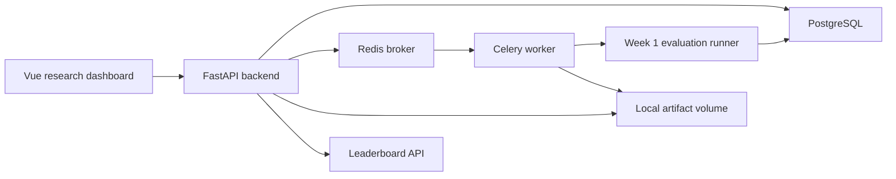

# ClimateNet-Bench

ClimateNet-Bench is a full-stack machine learning evaluation platform for land-surface hydroclimate stress benchmarks. It combines a reproducible climate ML benchmark with a FastAPI/PostgreSQL/Celery backend and a Vue research dashboard.

The current MVP focuses on a practical evaluation loop:

```text
prediction.csv upload
  -> submission record
  -> Celery evaluation task
  -> metrics persisted in PostgreSQL
  -> local artifact storage
  -> ranked leaderboard API
  -> Vue dashboard
```

## Current Status

| Area | Status |
|---|---|
| Week 1 benchmark core | Implemented: regression metrics, event detection metrics, LightGBM tests, mini leaderboard support |
| Week 2 backend platform | Implemented: SQLAlchemy models, Alembic migration, submission API, Celery worker, artifact download, leaderboard filters |
| Docker compose | Implemented and validated with `api`, `postgres`, `redis`, `worker` |
| Frontend workbench | In progress: Vue dashboard, submission page, evaluation detail page, DB-backed leaderboard |
| Portfolio packaging | Planned: demo scripts, screenshots, architecture docs, CI smoke demo |

Latest local verification:

```bash
env PYTEST_DISABLE_PLUGIN_AUTOLOAD=1 /home/drink8water/Extra/conda_envs/climatenet-py311/bin/pytest -q
# 388 passed, 1 skipped

cd frontend
npm run build
# vite production build passes
```

Docker compose validation has also been run on a remote Linux host. The tested flow was:

```text
docker compose up -d
GET /api/health
GET /api/models
POST /api/submissions/upload
GET /api/evaluation-runs/{id}/status
GET /api/evaluation-runs/{id}
GET /api/leaderboard
GET /api/artifacts/{id}/download
```

## What This Project Evaluates

The benchmark asks whether ML models trained on climate data generalize across unseen grid cells, future periods, and climate regimes.

The scientific focus is land-surface hydroclimate stress:

| Target | Meaning |
|---|---|
| `evaporation_anomaly` | Next-month land evaporation anomaly regression target |
| `soil_moisture_drought` | Event label for dry soil-moisture conditions |
| `evaporation_deficit` | Event label for anomalously low evaporation |
| `compound_hot_dry` | Combined hot and dry stress event |

Core metrics:

| Metric group | Metrics |
|---|---|
| Regression | MAE, RMSE, R2 |
| Event detection | POD, FAR, CSI, intensity bias |
| Generalization | Split-wise leaderboard, climate-zone filtering hooks |

## Architecture



### Backend

The platform backend lives under `backend/`.

Implemented API surface:

| Method | Endpoint | Purpose |
|---|---|---|
| `GET` | `/api/health` | API health check |
| `GET` | `/api/models` | List registered benchmark models |
| `GET` | `/api/datasets` | List registered datasets |
| `POST` | `/api/submissions` | Create a submission from an existing CSV path |
| `POST` | `/api/submissions/upload` | Upload `prediction.csv` and enqueue evaluation |
| `GET` | `/api/submissions/{id}` | Submission detail |
| `GET` | `/api/evaluation-runs/{id}` | Evaluation metrics and artifacts |
| `GET` | `/api/evaluation-runs/{id}/status` | Evaluation status polling |
| `GET` | `/api/leaderboard` | Ranked DB-backed leaderboard |
| `GET` | `/api/artifacts/{id}/download` | Download local artifact |

`/api/leaderboard` supports:

```text
metric
split_protocol
event_type
climate_zone
```

The backend is safe to import without `DATABASE_URL`. In that mode, database-backed endpoints return mock or empty responses instead of crashing.

### Database Schema

The Alembic migration creates eight platform tables:

```text
datasets
benchmark_tasks
split_protocols
models
submissions
evaluation_runs
metrics
artifacts
```

## Quick Start: Docker Compose

Docker compose is the recommended way to run the full backend loop.

```bash
docker compose up --build -d
docker compose ps
curl http://127.0.0.1:8000/api/health
```

The API container runs:

```text
alembic upgrade head
backend.seed
uvicorn backend.main:app
```

The worker container runs:

```text
alembic upgrade head
celery -A backend.celery_app.celery_app worker
```

PostgreSQL and Redis use compose health checks so the API and worker wait until dependencies are ready.

### Smoke Upload

Create a small CSV:

```bash
cat > /tmp/prediction.csv <<'CSV'
actual,prediction,soil_moisture_drought,soil_moisture_drought_pred
1.0,1.0,1,1
2.0,2.4,1,0
3.0,2.8,0,1
4.0,4.1,0,0
CSV
```

Upload it:

```bash
curl -s -X POST http://127.0.0.1:8000/api/submissions/upload \
  -F model_id=1 \
  -F benchmark_task_id=1 \
  -F split_protocol_id=1 \
  -F name=docker-smoke-test \
  -F prediction_csv=@/tmp/prediction.csv
```

Then check:

```bash
curl http://127.0.0.1:8000/api/evaluation-runs/1/status
curl http://127.0.0.1:8000/api/evaluation-runs/1
curl 'http://127.0.0.1:8000/api/leaderboard?metric=rmse'
```

## Local Development

This repository uses a local conda environment in development:

```bash
/home/drink8water/Extra/conda_envs/climatenet-py311
```

Run backend tests:

```bash
env PYTEST_DISABLE_PLUGIN_AUTOLOAD=1 /home/drink8water/Extra/conda_envs/climatenet-py311/bin/pytest -q
```

Run the API without a database:

```bash
env PYTHONPATH=$(pwd) /home/drink8water/Extra/conda_envs/climatenet-py311/bin/uvicorn backend.main:app --host 127.0.0.1 --port 8000
```

Run the frontend:

```bash
cd frontend
npm install
npm run dev
```

Open:

```text
http://127.0.0.1:5173
```

If port `5173` is busy, Vite will print the alternate port.

## Frontend Pages

| Page | Purpose |
|---|---|
| Overview | Project status, benchmark context, summary panels |
| Evaluation Platform | Upload `prediction.csv`, poll async evaluation, show metrics |
| Evaluation Detail | Inspect a completed run and its artifacts |
| Leaderboard | DB-backed ranking with metric and event filters |
| Split Difficulty | Compare split protocols |
| Forecast Explorer | Explore predictions and errors |
| Uncertainty | Calibration and interval diagnostics |
| Physical Audit | Physical consistency checks |
| Spatial Diagnostics | Spatial/time-series diagnostics |

The frontend is bilingual through the existing `i18n` helper and is intentionally styled as a research workbench rather than a marketing site.

## Repository Layout

```text
ClimateNet-Bench/
├── backend/                  # FastAPI, SQLAlchemy, Celery, platform services
├── alembic/                  # Database migrations
├── src/climatenet/           # Benchmark, data, evaluation, model code
├── frontend/                 # Vue 3 dashboard
├── tests/                    # Pytest suite
├── configs/                  # Benchmark configs
├── scripts/                  # CLI/demo scripts
├── docs/                     # Documentation
├── docker-compose.yml        # API/Postgres/Redis/worker stack
├── Dockerfile                # Slim API/worker image
└── requirements-api.txt      # Docker runtime dependencies
```

## Roadmap

Immediate next iteration:

1. Replace the manual upload-first workflow with an automated demo dashboard.
2. Add a one-click benchmark run that creates submissions, evaluates them, and refreshes the leaderboard.
3. Redesign the frontend around an experiment operations board:
   - run queue
   - latest metrics
   - leaderboard movements
   - event detection panel
   - artifact/log panel
4. Add `scripts/demo_smoke.py` for a 30-second local demo.
5. Add GitHub Actions for `ruff`, `pytest`, and demo smoke validation.

Planned documentation:

```text
docs/SYSTEM_ARCHITECTURE.md
docs/BENCHMARK_REPORT.md
docs/APPLICATION_PORTFOLIO.md
```

## Citation

```bibtex
@software{climatenet_bench,
  author = {ClimateNet-Bench Contributors},
  title = {ClimateNet-Bench: A Full-Stack ML Evaluation Platform for Hydroclimate Stress Benchmarks},
  year = {2026},
  url = {https://github.com/Drink8Water/ClimateNet-Bench}
}
```

## License

MIT License.
