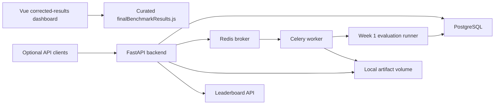

# ClimateNet-Bench

ClimateNet-Bench is a leakage-aware spatio-temporal machine-learning
benchmark for land-surface hydroclimate analysis. Its corrected ERA5-Land
workflow combines source-data auditing, per-split train-only preprocessing,
multi-seed evaluation, and repeated region-stratified spatial folds.

The current formal study predicts next-month evaporation anomalies in Sahara
and East China for 2019–2023 using traditional Linear and LightGBM baselines.
The repository also contains an optional evaluation API and a Vue single-page
results dashboard, but the scientific benchmark and its auditable artifacts
are the primary project.

```text
audited ERA5-Land records
  -> corrected accumulated variables
  -> row-wise physical features
  -> spatial/temporal split
  -> train-only climatology and scaling
  -> lag samples
  -> isolated model task
  -> metrics, predictions, metadata
```

## Current Status

| Area | Status |
|---|---|
| Corrected source data | Ready: 5,318,160 records, continuous 2019–2023 coverage, no tabular NaN/Inf or duplicate grid-month keys |
| Leakage controls | Per-split train-only climatology, anomaly generation, event thresholds, and standardization |
| Multi-seed benchmark | 18/18 corrected tasks completed across seeds 42, 123, and 2026 |
| Repeated spatial benchmark | 10/10 tasks completed across five region-stratified, leakage-free folds |
| Reproducibility | Isolated run directories, resolved configs, hashes, git state, predictions, metrics, and preprocessing provenance |

Latest local verification:

```bash
env PYTEST_DISABLE_PLUGIN_AUTOLOAD=1 /home/drink8water/Extra/conda_envs/climatenet-py311/bin/pytest -q
# 452 passed, 1 skipped
```

## Final Corrected Results

| Result | Value |
|---|---:|
| LightGBM random RMSE, 3 seeds | 5.766 ± 0.020 |
| LightGBM temporal RMSE, 3 seeds | 6.309 ± 0.015 |
| LightGBM repeated-spatial RMSE, 5 folds | 7.066 ± 1.093 |
| Linear repeated-spatial RMSE, 5 folds | 9.782 ± 0.773 |
| LightGBM repeated-spatial improvement | 27.8% mean RMSE reduction; wins 5/5 folds |

These claims are limited to Sahara and East China. The former uncorrected v1
runs are explicitly marked `source_data_invalid` and are retained only as a
data-audit case.

Start here:

- [Final corrected results](docs/FINAL_RESULTS.md)
- [Benchmark report](docs/BENCHMARK_REPORT.md)
- [Artifact index](docs/ARTIFACT_INDEX.md)
- [Configuration index](docs/CONFIG_INDEX.md)
- [Reproduction guide](docs/reproduce.md)

## What This Project Evaluates

The benchmark asks whether ML models trained on climate data generalize across unseen grid cells, future periods, and climate regimes.

The scientific focus is land-surface hydroclimate stress:

| Target | Meaning |
|---|---|
| `evaporation_anomaly` | Next-month land evaporation anomaly regression target |
| `soil_moisture_drought` | Event label for dry soil-moisture conditions |
| `evaporation_deficit` | Event label for anomalously low evaporation |
| `compound_hot_dry` | Combined hot and dry stress event |

Core metrics:

| Metric group | Metrics |
|---|---|
| Regression | MAE, RMSE, R2 |
| Event detection | POD, FAR, CSI, intensity bias |
| Generalization | Split-wise leaderboard, climate-zone filtering hooks |

## Results Dashboard and Optional Evaluation Platform

The current frontend is a compact Vue 3 + ECharts results dashboard for the
corrected ERA5-Land benchmark. It reads the curated formal-results dataset in
`frontend/src/data/finalBenchmarkResults.js` and intentionally excludes
synthetic smoke outputs and historical `source_data_invalid` runs.

The backend evaluation API remains in the repository as an optional platform
layer for submission/evaluation workflows. It is not required to reproduce the
corrected benchmark results.

### Architecture



### Frontend

The frontend lives under `frontend/` and currently presents one formal results
page with:

| Section | Purpose |
|---|---|
| Dataset and provenance | Corrected ERA5-Land records, lag samples, source-data audit, and invalid-run exclusion |
| Final metrics | Corrected multi-seed and repeated-spatial mean/std results |
| Split diagnostics | Temporal robustness, repeated spatial folds, and single-spatial-holdout caveats |
| Regional findings | East China vs Sahara error pattern |
| Reproducibility | Links to final result, artifact, config, and benchmark reports |

Run it locally:

```bash
cd frontend
npm install
npm run dev
```

Open:

```text
http://127.0.0.1:5173
```

If port `5173` is busy, Vite will print the alternate port.

Build:

```bash
npm run build
```

### Backend

The platform backend lives under `backend/`.

Implemented API surface:

| Method | Endpoint | Purpose |
|---|---|---|
| `GET` | `/api/health` | API health check |
| `GET` | `/api/models` | List registered benchmark models |
| `GET` | `/api/datasets` | List registered datasets |
| `POST` | `/api/submissions` | Create a submission from an existing CSV path |
| `POST` | `/api/submissions/upload` | Upload `prediction.csv` and enqueue evaluation |
| `GET` | `/api/submissions/{id}` | Submission detail |
| `GET` | `/api/evaluation-runs/{id}` | Evaluation metrics and artifacts |
| `GET` | `/api/evaluation-runs/{id}/status` | Evaluation status polling |
| `GET` | `/api/leaderboard` | Ranked DB-backed leaderboard |
| `GET` | `/api/artifacts/{id}/download` | Download local artifact |

`/api/leaderboard` supports:

```text
metric
split_protocol
event_type
climate_zone
```

The backend is safe to import without `DATABASE_URL`. In that mode, database-backed endpoints return mock or empty responses instead of crashing.

### Database Schema

The Alembic migration creates eight platform tables:

```text
datasets
benchmark_tasks
split_protocols
models
submissions
evaluation_runs
metrics
artifacts
```

## Quick Start: Docker Compose

Docker compose is the recommended way to run the full backend loop.

```bash
docker compose up --build -d
docker compose ps
curl http://127.0.0.1:8000/api/health
```

The API container runs:

```text
alembic upgrade head
backend.seed
uvicorn backend.main:app
```

The worker container runs:

```text
alembic upgrade head
celery -A backend.celery_app.celery_app worker
```

PostgreSQL and Redis use compose health checks so the API and worker wait until dependencies are ready.

### Smoke Upload

Create a small CSV:

```bash
cat > /tmp/prediction.csv <<'CSV'
actual,prediction,soil_moisture_drought,soil_moisture_drought_pred
1.0,1.0,1,1
2.0,2.4,1,0
3.0,2.8,0,1
4.0,4.1,0,0
CSV
```

Upload it:

```bash
curl -s -X POST http://127.0.0.1:8000/api/submissions/upload \
  -F model_id=1 \
  -F benchmark_task_id=1 \
  -F split_protocol_id=1 \
  -F name=docker-smoke-test \
  -F prediction_csv=@/tmp/prediction.csv
```

Then check:

```bash
curl http://127.0.0.1:8000/api/evaluation-runs/1/status
curl http://127.0.0.1:8000/api/evaluation-runs/1
curl 'http://127.0.0.1:8000/api/leaderboard?metric=rmse'
```

## Local Development

This repository uses a local conda environment in development:

```bash
/home/drink8water/Extra/conda_envs/climatenet-py311
```

Run backend tests:

```bash
env PYTEST_DISABLE_PLUGIN_AUTOLOAD=1 /home/drink8water/Extra/conda_envs/climatenet-py311/bin/pytest -q
```

## Reproducible Benchmark Runs

Each benchmark invocation creates a new isolated directory:

```text
outputs/benchmark_runs/<benchmark>-<data-source>-<utc>-<hash>-<suffix>/
```

Synthetic and ERA5-Land results therefore cannot overwrite or share an
experiment registry. A fresh model object is created for every
`model × split × feature_set × seed` combination, and the configured seed is
applied immediately before model construction and fitting.

Every run contains `config_resolved.yaml`, `run_metadata.json`, split
manifests, train-only preprocessing artifacts, canonical per-task metrics and
predictions, `leaderboard.csv`, and `summary.json`. Metadata includes the data
audit, environment versions, input hashes, git commit and dirty flag, task
failures, and preprocessing fallback totals. Existing output runs are
preserved.

Build a leaderboard from the newest isolated run:

```bash
python scripts/build_leaderboard.py \
  --experiments-dir outputs/benchmark_runs/<run-id>/experiments \
  --output-dir outputs/benchmark_runs/<run-id>
```

Use `--run-id <id>` to select a specific historical run. The leaderboard
builder never combines different run IDs or data sources. See
[`docs/reproduce.md`](docs/reproduce.md) for the complete workflow.

Run the API without a database:

```bash
env PYTHONPATH=$(pwd) /home/drink8water/Extra/conda_envs/climatenet-py311/bin/uvicorn backend.main:app --host 127.0.0.1 --port 8000
```

## Repository Layout

```text
ClimateNet-Bench/
├── backend/                  # FastAPI, SQLAlchemy, Celery, platform services
├── alembic/                  # Database migrations
├── src/climatenet/           # Benchmark, data, evaluation, model code
├── frontend/                 # Vue 3 corrected-results dashboard
├── tests/                    # Pytest suite
├── configs/                  # Benchmark configs
├── scripts/                  # CLI/demo scripts
├── docs/                     # Documentation
├── docker-compose.yml        # API/Postgres/Redis/worker stack
├── Dockerfile                # Slim API/worker image
└── requirements-api.txt      # Docker runtime dependencies
```

## Project Boundaries

The final benchmark does not claim global performance, climate-zone transfer,
or superiority over deep-learning models. Future work can map climate zones,
add broader regions/years, and extend the results dashboard without changing
the established result provenance.

## Citation

```bibtex
@software{climatenet_bench,
  author = {ClimateNet-Bench Contributors},
  title = {ClimateNet-Bench: A Leakage-Aware Spatio-Temporal ERA5-Land Benchmark},
  year = {2026},
  url = {https://github.com/Drink8Water/ClimateNet-Bench}
}
```

## License

MIT License.
